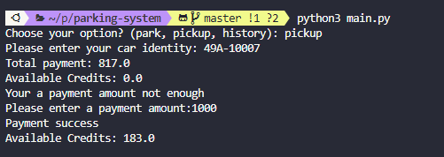

## CONSOLE PARKING SYSTEMS

Steps to install and run program:  

1: Install virtual environment and active

    python3 -m venv .venv
    source .venv/bin/active

2: Install packet openpyxl and pytest

    pip install openpyxl pytest

3: Run command

    python3 main.py

4: if you want to deavtivate environment just:

    deactive

## EXPLAIN SOURCE CODE

<ul>
    <li>models: contains system entities(customer, bill, history)</li>
    <li>handlers: contains functions related to datetime, file, and excel processing</li>
    <li>validator: contains function related to validator processing</li>
    <li>services: contains functions related to logic feature processing</li>
    <li>store: stored customer information such as bill, credit card, indetity </li>
    <li>tests: unit test </li>
</ul>

## EXPLAIN FEATURES

### PARK

Customer will need to input: **_car identity_** **_frequent parking number_**

System will collect the information and store them in file(s) in **_stored/cutomers_**

### PICKUP

Customer will need to input the **_car identity_**

System will calculate and display the parking price and stored information excel format in **_store/bills_**

Customer will pay the fee by input a payment amount

The exceed amount will be kept for next payment

stored in **_store/credits/_**

## HISTORY

The customer will need to input **_car identity_**

System will export file and stored history information:

